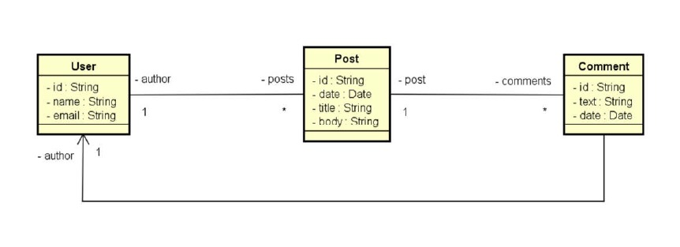

# 📌 API REST com Java e MongoDB

## Descrição  
Este projeto tem como objetivo a criação de um sistema básico de CRUD utilizando **Java com Spring Boot e MongoDB**. A **API REST** permite a gestão de **usuários e posts**, seguindo princípios de **arquitetura RESTful**.  

O desenvolvimento foi realizado com base nas aulas do Professor Nélio Alves em seu curso disponível na Udemy -> [Java Completo - Programação Orientada a Objetos + Projetos](https://www.udemy.com/course/java-curso-completo) 

---

## 🎯 Objetivos  
✔ **Configuração inicial:** Estruturação do projeto Java com Spring Boot.  
✔ **Domain Model:** Implementação de um modelo de domínio representando as entidades e seus relacionamentos.  
✔ **Estrutura em camadas:** Separação das camadas de lógica em **Resource(Controller), Service e Repository**.  
✔ **Banco de Dados NoSQL:** Utilização do **MongoDB** como banco de dados.  
✔ **CRUD Implementado:** Operações principais (**criação, consulta, atualização e exclusão**) para as entidades do sistema.  
✔ **Tratamento de Exceções:** Implementação de mecanismos para respostas adequadas aos usuários da API.   

---

## 🛠 Tecnologias Utilizadas  
Este projeto foi desenvolvido utilizando as seguintes tecnologias:  

- **Java 17** - Linguagem principal utilizada no desenvolvimento.  
- **Spring Boot 3.3.4** - Framework para criação de aplicações Java, simplificando a configuração e desenvolvimento.  
- **Spring Boot Starter Web** - Dependência para construção de **APIs REST**.  
- **Spring Boot Starter Data MongoDB** - Integração com **MongoDB** para persistência de dados.  
- **Spring Boot Starter Test** - Ferramentas para criação de testes automatizados.  
- **Maven** - Gerenciador de dependências e automação do build.  
- **Swagger** - Ferramenta de documentação, testes e visualização de **API's REST**.  

---

### DIAGRAMA DE CLASSES

---

## 📌 Endpoints da API  

### 📁 **Usuários**  
- `GET /springmongodb/users` → Lista todos os usuários  
- `GET /springmongodb/users/{id}` → Recupera um usuário a partir do ID  
- `POST /springmongodb/users` → Insere um novo usuário (**conteúdo no corpo da requisição**)  
- `PUT /springmongodb/users/{id}` → Atualiza um usuário a partir do ID  
- `DELETE /springmongodb/users/{id}` → Remove um usuário pelo ID  
- `GET /springmongodb/users/{id}/posts` → Lista todos os posts de um usuário pelo ID  

### 📦 **Posts**  
- `GET /springmongodb/posts/{id}` → Recupera um post a partir do ID  
- `GET /springmongodb/posts/titlesearch?text={texto}` → Busca posts por título ou parte dele  
- `GET /springmongodb/posts/fullsearch?text={texto}&minDate={dataMinima}&maxDate={dataMaxima}` → Busca completa de posts por texto e intervalo de datas  

---

## 📬 Contato  
📧 **E-mail:** [fabio.tritono@gmail.com](mailto:fabio.tritono@gmail.com)  
🐙 **LinkedIn:** [linkedin.com/in/fabio-britto-399223252](https://www.linkedin.com/in/fabio-britto-399223252/)  

